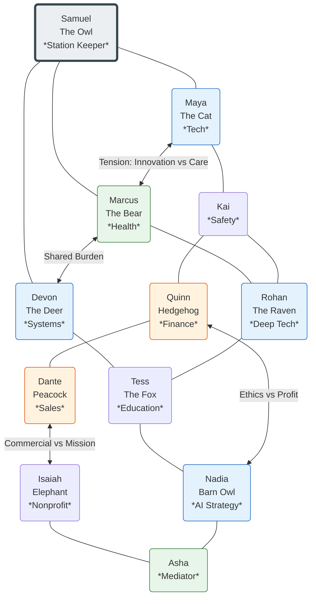
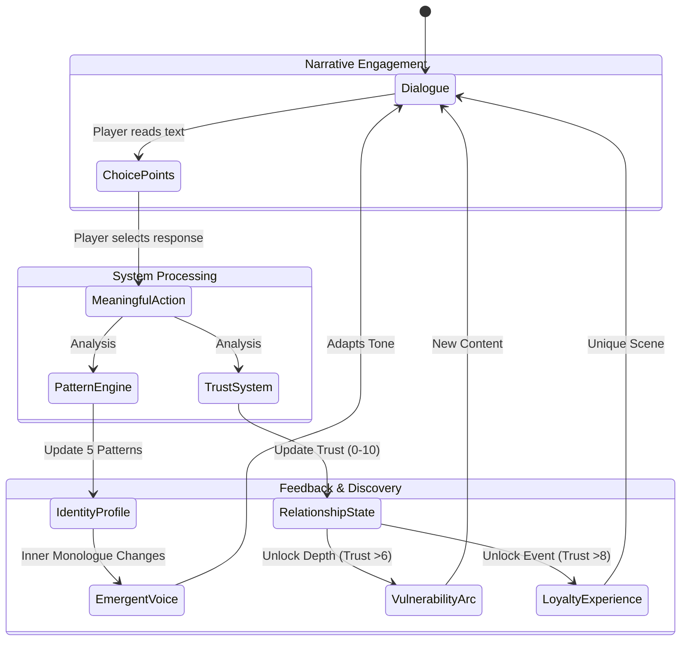
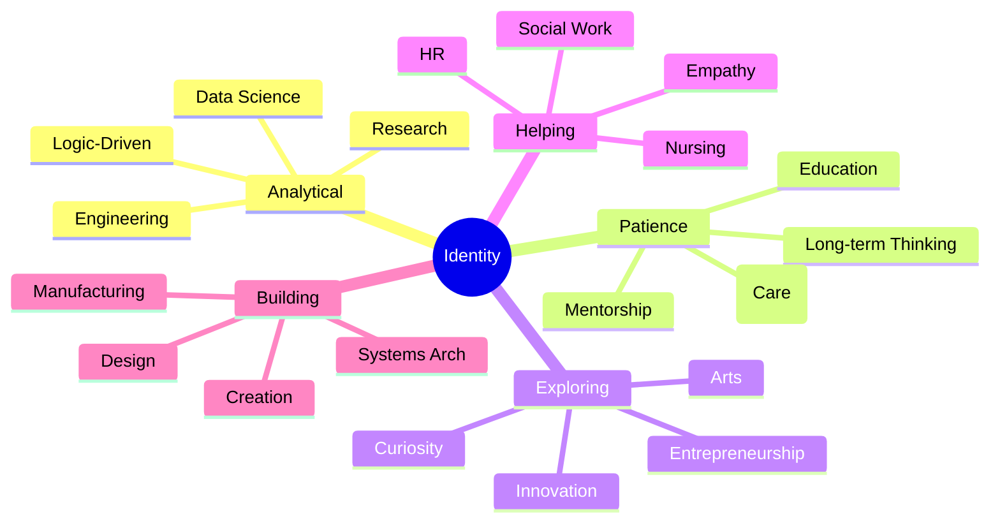

# Visual System Diagrams
**Source:** `STAKEHOLDER_OVERVIEW.md` & `CHARACTER_STYLES_REFERENCE.md`

## 1. Grand Central Terminus: System Architecture
*Visualizing the Technical Stack described in Stakeholder Overview*

```mermaid
graph TD
    subgraph "Frontend (Next.js 15)"
        UI[User Interface]
        DialogueComp[Dialogue System]
        JournalComp[Journal & Stats]
        ConstellationComp[Constellation Graph]
        
        UI --> DialogueComp
        UI --> JournalComp
        UI --> ConstellationComp
        
        StateStore[Zustand State Store]
        DialogueComp <--> StateStore
        JournalComp <--> StateStore
        ConstellationComp <--> StateStore
    end

    subgraph "Game Logic Layer (TypeScript)"
        PatternEng[Pattern Engine]
        TrustSys[Trust & Progression]
        DialogueNav[Dialogue Navigator]
        Achievements[Achievement System]
        
        StateStore <--> PatternEng
        StateStore <--> TrustSys
        StateStore <--> DialogueNav
        StateStore <--> Achievements
    end

    subgraph "Data Content"
        Nodes[1,431 Dialogue Nodes]
        Chars[20 Character Definitions]
        Patterns[5 Behavioral Patterns]
        
        DialogueNav --> Nodes
        TrustSys --> Chars
        PatternEng --> Patterns
    end

    style Frontend fill:#e1f5fe,stroke:#01579b
    style "Game Logic Layer (TypeScript)" fill:#fff9c4,stroke:#fbc02d
    style "Data Content" fill:#e8f5e9,stroke:#2e7d32
```

---

## 2. The Living Station: Character Relationship Web
*Mapping the interconnected relationships from Character Styles Reference*



---

## 3. The Core Engagement Loop
*Visualizing the "Game Design Principles" section*



---

## 4. Behavioral Pattern Map
*Visualizing the 5 Core Patterns and their Career Allignments*


